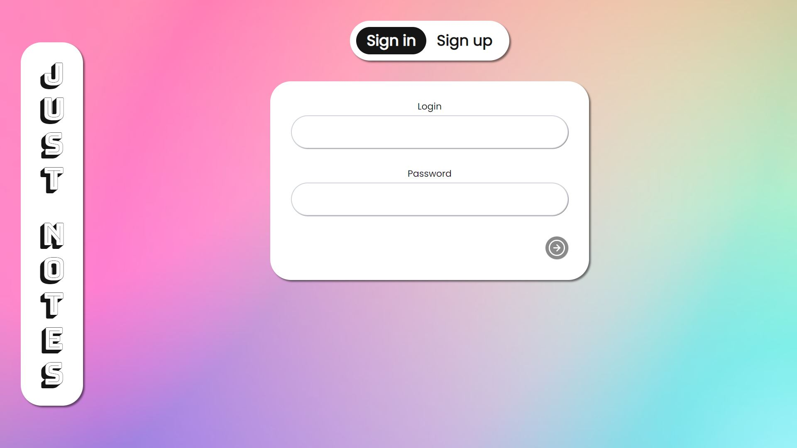
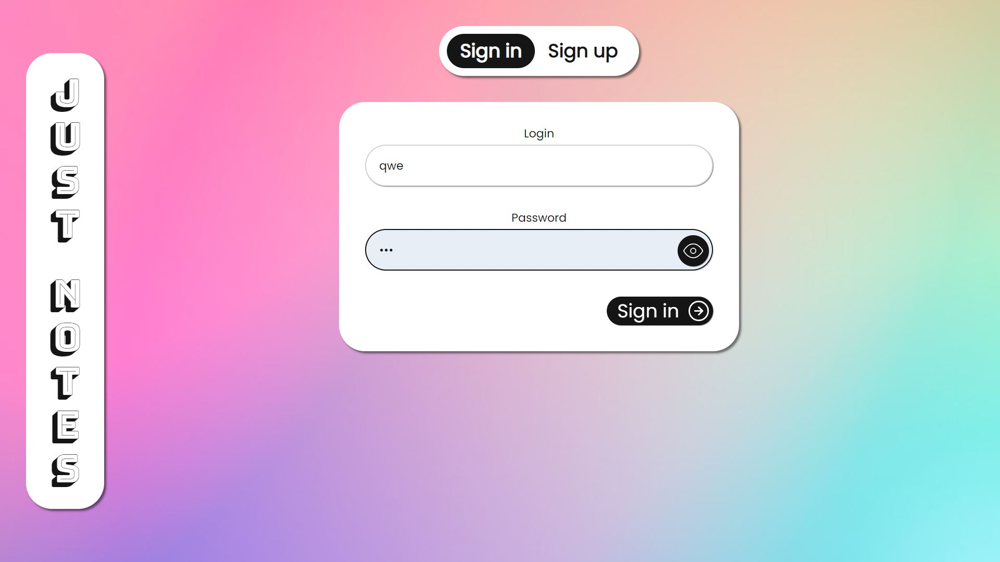
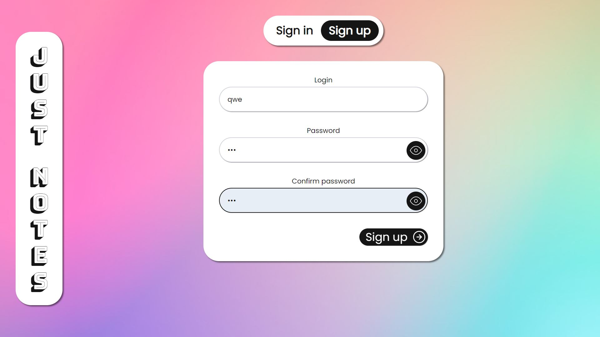
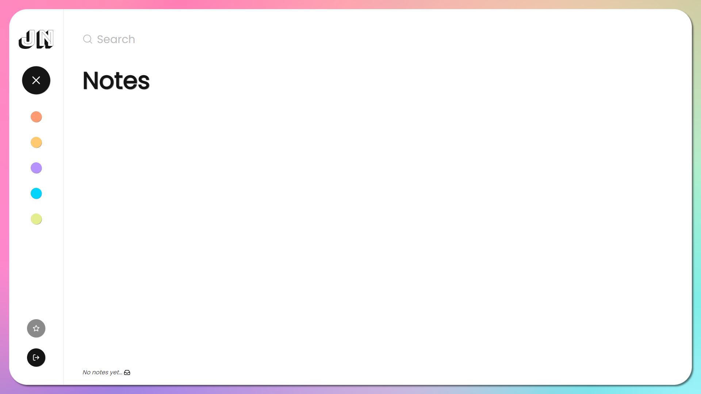
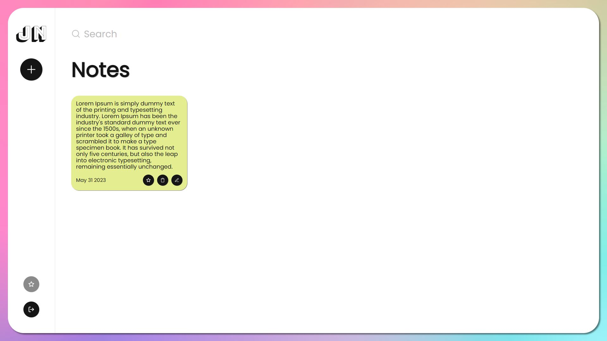
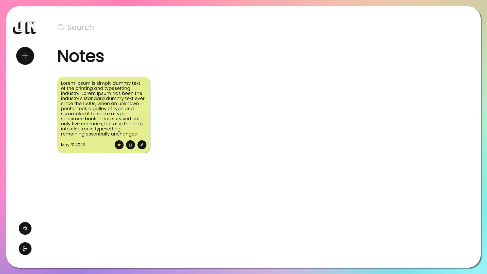
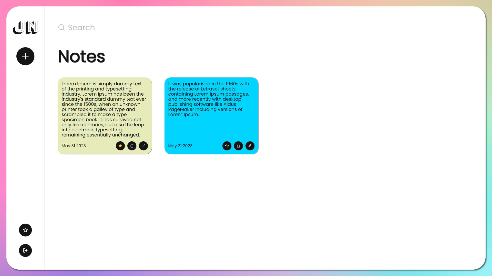
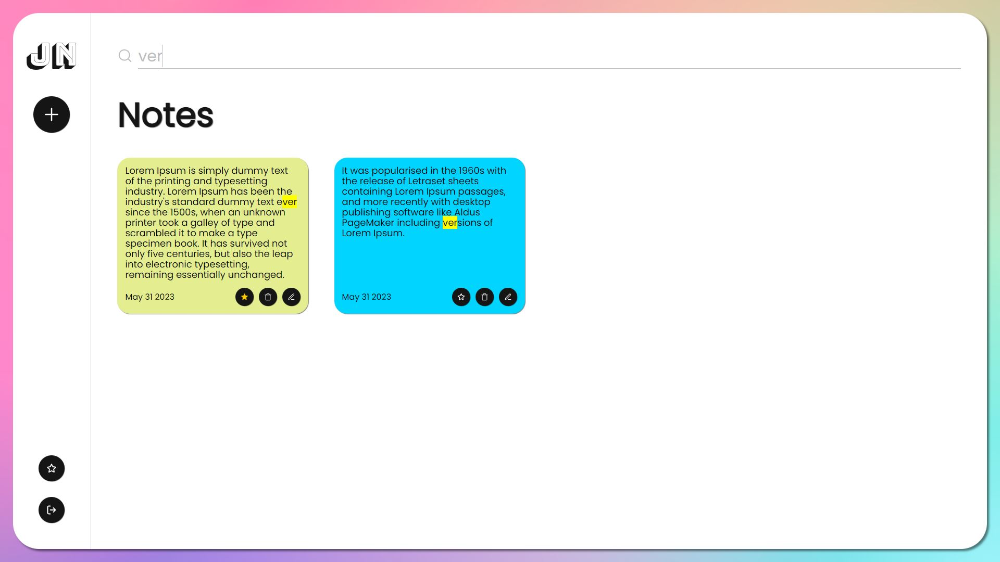
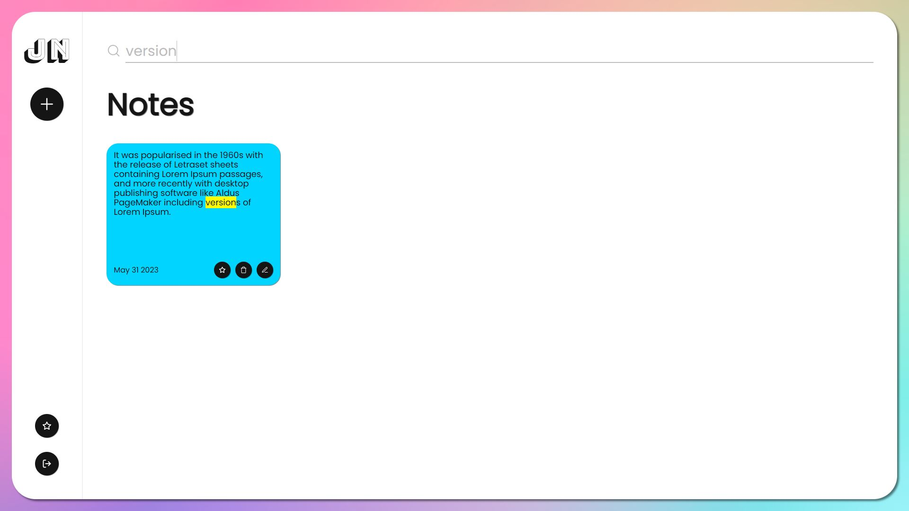

# Just Notes

**Sign in form**

**Sign up form**

**Main screen**

To install und run the project:

 ### `1. npm install`
 ### `2. npx prisma migrate dev --name init`
 ### `3. npm run dev`

Disclaimer: Please note that this project is for demonstrational and educational purposes only.